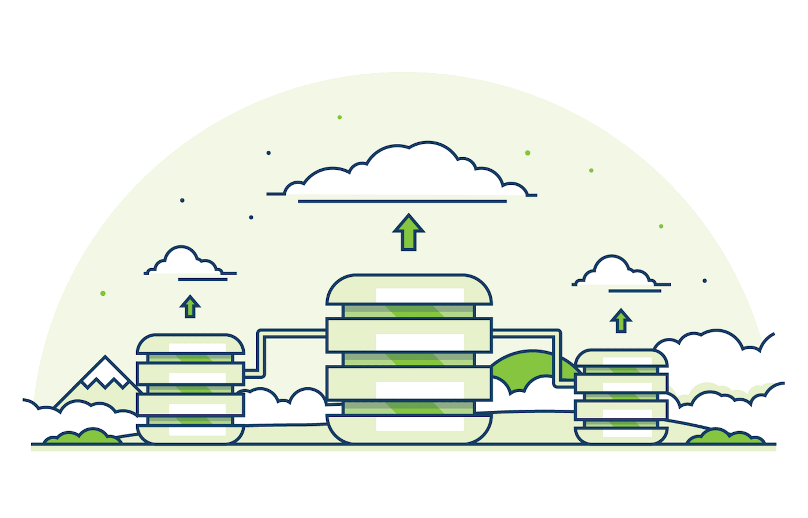
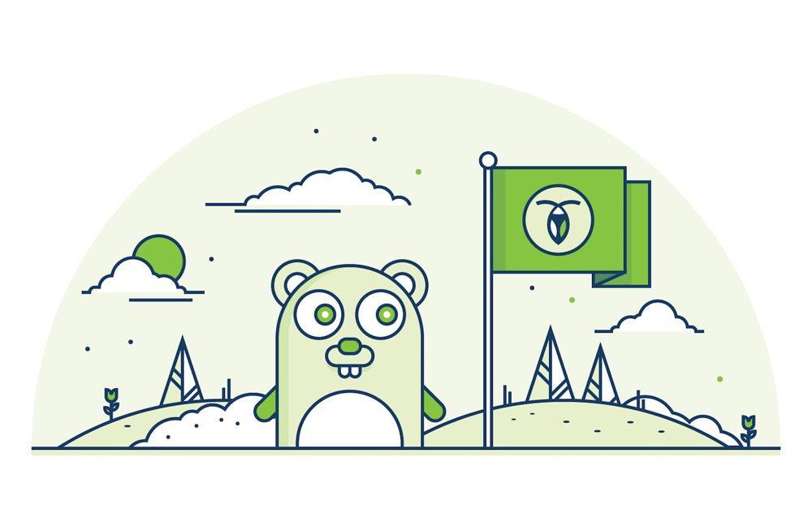

## Automated Scaling & Repair

CockroachDB transparently manages scale with an upgrade path from a single node to hundreds. Easily add capacity to the cluster by starting new storage containers and CockroachDB automatically rebalances existing data. Kill a container and CockroachDB re-replicates its data from available sources. With a simple configuration change you can even scale between cloud service providers or migrate your entire service without downtime.

-   Add resources to scale horizontally, with zero hassle and no downtime
-   Self-organizes, self-heals, and automatically rebalances
-   Migrate data seamlessly between clouds

## Strong Consistency

CockroachDB implements consistent replication via majority consensus between replicas. This allows forward progress for both readers and writers in the event of failures, with no possibility of reading stale data. Applications can be written without being defensive, making them simpler and less error-prone. Consistent replication can be configured within or across datacenters for high availability. Upgrade… Patch… Restart… Rest assured, your applications won’t notice.

-   No downtime for server restarts, machine failures, or datacenter outages
-   Local or wide-area replication with no stale reads on failover
-   Employs Raft, a popular successor to Paxos

## Distributed Transactions

CockroachDB implements efficient, fully-serializable distributed transactions. What exactly is the difference between “repeatable read” and “serializable”? With CockroachDB, it’s a moot point. Stop using external locking mechanisms or half measures like CAS or “lightweight” transactions. CockroachDB transactions are integral and high performance, freeing developers to build applications.

-   Easily build consistent applications
-   Optimistic concurrency without locking
-   Efficient two phase commit
-   Serializable default isolation level

## Simplified Deployment

Deploying and maintaining databases has forever been a difficult and expensive prospect. Simplicity is one of our foremost design goals. CockroachDB is self contained and eschews external dependencies. There are no explicit roles like masters, slaves, primaries, or secondaries to get in the way. Instead, every CockroachDB node is symmetric and equally important, meaning no single points of failure in the architecture.

-   No external dependencies
-   Self-organizes using gossip network
-   Dead-simple configuration without “knobs”
-   Symmetric nodes are ideally suited to container-based deployments
-   Every node provides access to centralized admin console

## Open Source

Run on your laptop, development cluster, and public or private cloud without complex licensing, mock implementations, or inscrutable closed-source error output. Be a part of our vibrant community of developers and users! And if you really love databases, you can contribute to the design and implementation as it evolves.

-   Keep your options open and avoid vendor lock-in
-   Easy experimentation and enhancement
-   Bigger and more active community for support and troubleshooting
-   Debug problems through your entire stack

## Go Implementation

The choice of language matters. Speed, stability, maintainability: each of these attributes of the underlying language can impact how quickly CockroachDB evolves and how well it works. Not all languages were created equal. Go is an open source programming language developed primarily at Google as a viable alternative to C++ and Java.

-   Excellent environment for building distributed systems
-   Compiles for native performance
-   Garbage collection and type safety provide stability
-   Readable, well-documented code encourages open source contributions

