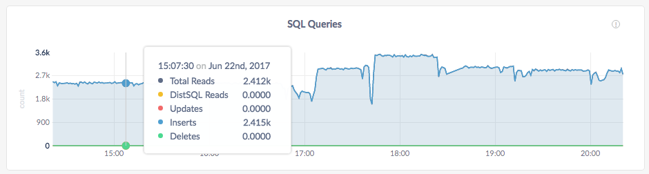
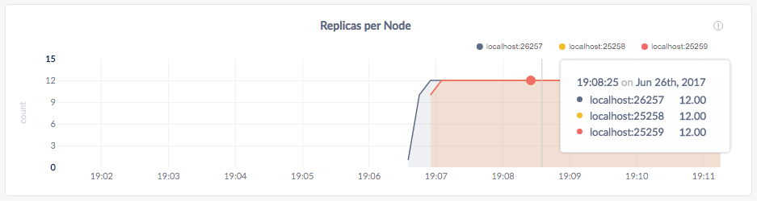
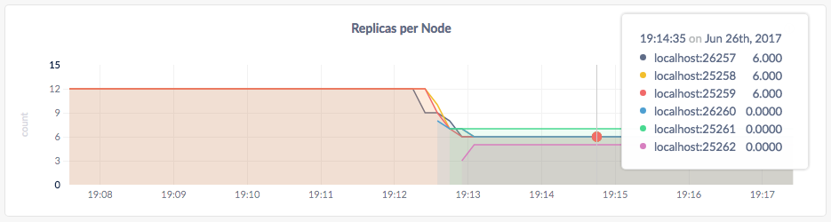
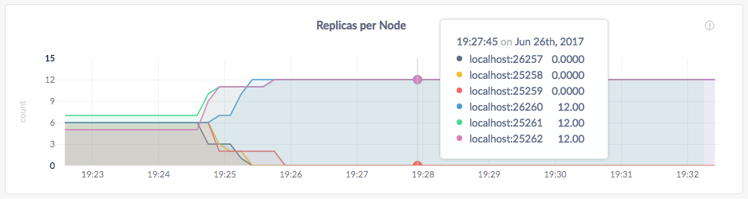

CockroachDB's flexible [replication controls](configure-replication-zones.html) make it trivially easy to run a single CockroachDB cluster across cloud platforms or to migrate a cluster from one cloud to another without any service interruption. This page walks you through a local simulation of the process.

## Before You Begin

In this tutorial, you'll use CockroachDB, the HAProxy load balancer, and CockroachDB's version of the YCSB load generator, which requires Go. Before you begin, make sure these applications are installed:

- Install the latest version of [CockroachDB](install-cockroachdb.html).
- Install [HAProxy](http://www.haproxy.org/). If you're on a Mac and using Homebrew, use `brew install haproxy`.
- Install [Go](https://golang.org/dl/). If you're on a Mac and using Homebrew, use `brew install go`.
- Install the [CockroachDB version of YCSB](https://github.com/cockroachdb/loadgen/tree/master/ycsb): `go get github.com/cockroachdb/loadgen/ycsb`

Also, to make it easy to keep track of the data files and logs for your cluster, you may want to create a new directory (e.g., `mkdir cloud-migration`) and start all your nodes in that directory.

## Step 1. Start a 3-node cluster on "cloud 1"

If you've already [started a local cluster](start-a-local-cluster.html), these commands should be familiar to you. The new flag to note is [`--locality`](configure-replication-zones.html#descriptive-attributes-assigned-to-nodes), which accepts key-value pairs that describe the locality of a node. In this case, you're using the flag to specify that the first 3 nodes are running on "cloud platform 1".

In a new terminal, start node 1 on cloud 1:

~~~ shell
$ cockroach start --insecure \
--locality=cloud=1 \
--store=cloud1node1 \
--host=localhost \
--cache=100MB
~~~~

In a new terminal, start node2 on cloud 1:

~~~ shell
$ cockroach start --insecure \
--locality=cloud=1 \
--store=cloud1node2 \
--host=localhost \
--port=25258 \
--http-port=8081 \
--join=localhost:26257 \
--cache=100MB
~~~

In a new terminal, start node 3 on cloud 1:

~~~ shell
$ cockroach start --insecure \
--locality=cloud=1 \
--store=cloud1node3 \
--host=localhost \
--port=25259 \
--http-port=8082 \
--join=localhost:26257 \
--cache=100MB
~~~

## Step 2. Set up HAProxy load balancing

Each CockroachDB node is an equally suitable SQL gateway to your cluster, but to ensure an even balancing of client requests across available nodes, we can use a TCP load balancer. The [HAProxy](http://www.haproxy.org/) load balancer that you installed before getting started is one of the most popular open-source TCP load balancers, and CockroachDB includes a built-in command for generating an HAProxy configuration file that is preset to work with your running cluster.

In a new terminal, run the [`cockroach gen haproxy`](generate-cockroachdb-resources.html) command, specifying the port of any node:

~~~ shell
$ cockroach gen haproxy --insecure --host=localhost --port=26257
~~~

This command generates an `haproxy.cfg` file automatically configured to work with the 3 nodes of your running cluster. In the file, change `bind :26257` to `bind :26000`. This changes the port on which HAProxy accepts requests to a port that is not already in use by a node and that won't be used by the nodes you'll add later.

~~~
global
  maxconn 4096

defaults
    mode                tcp
    timeout connect     10s
    timeout client      1m
    timeout server      1m

listen psql
    bind :26000
    mode tcp
    balance roundrobin
    server cockroach1 localhost:26257
    server cockroach2 localhost:26258
    server cockroach3 localhost:26259
~~~

Start HAProxy, with the `-f` flag pointing to the `haproxy.cfg` file:

~~~ shell
$ haproxy -f haproxy.cfg
~~~

## Step 3. Start a load generator

The YCSB load generator that you installed before getting started lets you simulate several client connections performing mixed read/write workloads against the cluster.

In a new terminal, start the load generator:

~~~ shell
$ $HOME/go/bin/ycsb -duration 20m -tolerate-errors -concurrency 10 -rate-limit 100 'postgresql://root@localhost:26000?sslmode=disable'
~~~

This command initiates 10 concurrent client workloads for 20 minutes, but limits each worker to 100 operations per second (since you're running everything on a single machine).

## Step 4. Watch data balance across all 3 nodes

Open the Admin UI at `http://localhost:8080` and hover over the **SQL Queries** graph at the top. After a minute or so, you'll see that the load generator is executing approximately 95% reads and 5% writes across all nodes:

Scroll down a bit and hover over the **Replicas per Node** graph. Because CockroachDB replicates each piece of data 3 times by default, the replica count on each of your 3 nodes should be identical:

## Step 5. Add 3 nodes on "cloud 2"

Again, the flag to note is [`--locality`](configure-replication-zones.html#descriptive-attributes-assigned-to-nodes), which you're using to specify that these next 3 nodes are running on "cloud platform 2".

{{site.data.alerts.callout_info}}If you were running nodes across clouds for real, you'd also configure firewalls to allow inbound and outbound communication between all the nodes. {{site.data.alerts.end}}

~~~ shell
# In a new terminal, start node 4 on cloud 2
$ cockroach start --insecure \
--locality=cloud=2 \
--store=cloud2node4 \
--host=localhost \
--port=26260 \
--http-port=8083 \
--join=localhost:26257 \
--cache=100MB

# In a new terminal, start node 5 on cloud 2:
$ cockroach start --insecure \
--locality=cloud=2 \
--store=cloud2node5 \
--host=localhost \
--port=25261 \
--http-port=8084 \
--join=localhost:26257 \
--cache=100MB

# In a new terminal, start node 6 on cloud 2:
$ cockroach start --insecure \
--locality=cloud=2 \
--store=cloud2node6 \
--host=localhost \
--port=25262 \
--http-port=8085 \
--join=localhost:26257 \
--cache=100MB
~~~

## Step 6. Watch data balance across all 6 nodes

Back in the Admin UI, hover over the **Replicas per Node** graph again. Because you set [`--locality`](configure-replication-zones.html#descriptive-attributes-assigned-to-nodes) settings to specify that nodes are running across 2 clouds, you'll see an approximately even replica count on each node, indicating that CockroachDB has automatically rebalanced replicas across the cloud platforms:

Note that it takes a few minutes for the Admin UI to show accurate per-node replica counts on hover, which is why the new nodes show 0 replicas in the screenshot above. However, the graph lines are accurate, and you can click **View node list** in the **Summary** area for another accurate view of per-node replica counts.

## Step 7. Migrate all data to "cloud 2"

In a new terminal, edit the default replication zone, adding a [hard constraint](configure-replication-zones.html#replication-constraints) that all replicas must be on nodes with `--locality=cloud=2`:

~~~ shell
$ echo 'constraints: [+cloud=2]' | cockroach zone set .default --insecure --host=localhost -f -
~~~

{{site.data.alerts.callout_info}} As you'll see in the next step, as long as the <code>--locality</code> flag was set properly on nodes, <strong>this single command is all it takes to initiate an automatic migration from one cloud to another</strong>.{{site.data.alerts.end}}

## Step 8. Verify the data migration

Back in the Admin UI, hover over the **Replicas per Node** graph again. Very soon, you should see the replica count double on nodes 4, 5, and 6 and drop to 0 on nodes 1, 2, and 3:

This indicates that all data has been migrated from "cloud 1" to "cloud 2". In a real cloud migration scenario, at this point you would update the load balancer to point to the nodes on "cloud 2" and then stop the nodes on "cloud 1". But for the purpose of this local simulation, there's no need to do that.

## Step 9. Stop the cluster

Stop YCSB by switching into its terminal and pressing **CTRL + C**. Then do the same for HAProxy and each CockroachDB node.

{{site.data.alerts.callout_success}}For the last node, the shutdown process will take longer (about a minute) and will eventually force kill the node. This is because, with only 1 node still online, a majority of replicas are no longer available (2 of 3), and so the cluster is not operational. To speed up the process, press <strong>CTRL + C</strong> a second time.{{site.data.alerts.end}}

If you don't plan to restart the cluster, you may want to remove the nodes' data stores and the HAProxy config file:

~~~ shell
$ rm -rf cloud1node1 cloud1node2 cloud1node3 cloud2node4 cloud2node5 cloud2node6 haproxy.cfg
~~~

## What's Next?

Use a local cluster to explore these other core CockroachDB features:

- [Data Replication](demo-data-replication.html)
- [Fault Tolerance & Recovery](demo-fault-tolerance-and-recovery.html)
- [Automatic Rebalancing](demo-automatic-rebalancing.html)
