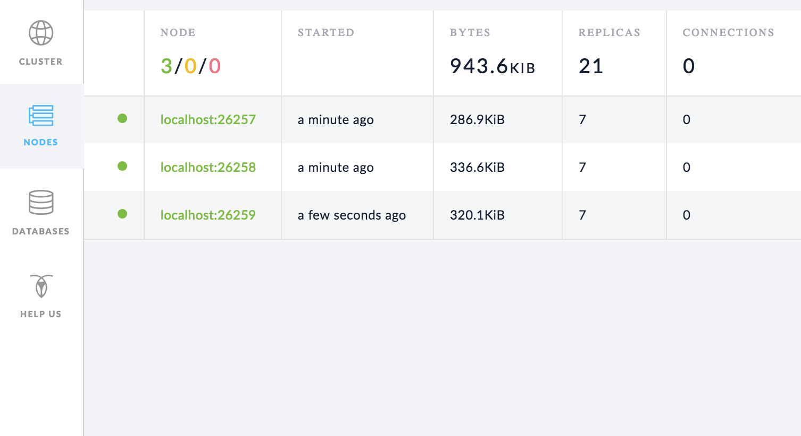
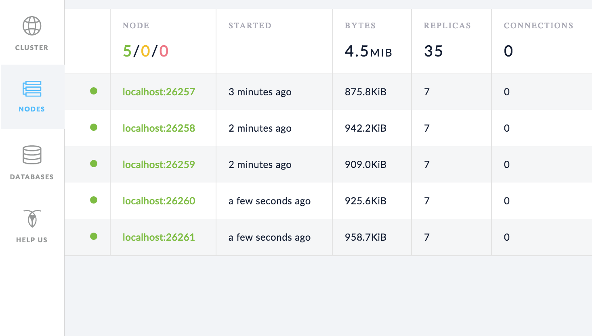

This page walks you through a simple demonstration of how CockroachDB replicates and distributes data. Starting with a 1-node local cluster, you'll write some data, add 2 nodes, and watch how the data is replicated automatically. You'll then update the cluster to replicate 5 ways, add 2 more nodes, and again watch how all existing replicas are re-replicated to the new nodes. 

## Before You Begin

Make sure you have already [installed CockroachDB](install-cockroachdb.html).

## Step 1. Start a 1-node cluster

~~~ shell
$ cockroach start --background \
--store=repdemo-node1
~~~

## Step 2. Write data

Use the [`cockroach gen`](generate-cli-utilities-and-example-data.html) command to generate an example `intro` database:

<pre class="highlight"><code data-eventcategory="replication1-gen-data">cockroach gen example-data intro | cockroach sql
</code></pre>

~~~ 
CREATE DATABASE
SET
DROP TABLE
CREATE TABLE
INSERT 1
INSERT 1
INSERT 1
INSERT 1
...
~~~

Open the [built-in SQL shell](use-the-built-in-sql-client.html) and verify that the new `intro` database was added with one table, `mytable`:

~~~ shell
$ cockroach sql
# Welcome to the cockroach SQL interface.
# All statements must be terminated by a semicolon.
# To exit: CTRL + D.
~~~

~~~ sql
> SHOW DATABASES;
~~~

~~~
+--------------------+
|      Database      |
+--------------------+
| information_schema |
| pg_catalog         |
| intro              |
| system             |
+--------------------+
(4 rows)
~~~

~~~ sql
> SHOW TABLES FROM intro;
~~~

~~~
+---------+
|  Table  |
+---------+
| mytable |
+---------+
(1 row)
~~~

~~~ sql
> SELECT * FROM intro.mytable WHERE (l % 2) = 0;
~~~

~~~
+----+-----------------------------------------------------+
| l  |                          v                          |
+----+-----------------------------------------------------+
|  0 | !__aaawwmqmqmwwwaas,,_        .__aaawwwmqmqmwwaaa,, |
|  2 | !"VT?!"""^~~^"""??T$Wmqaa,_auqmWBT?!"""^~~^^""??YV^ |
|  4 | !                    "?##mW##?"-                    |
|  6 | !  C O N G R A T S  _am#Z??A#ma,           Y        |
|  8 | !                 _ummY"    "9#ma,       A          |
| 10 | !                vm#Z(        )Xmms    Y            |
| 12 | !              .j####mmm#####mm#m##6.               |
| 14 | !   W O W !    jmm###mm######m#mmm##6               |
| 16 | !             ]#me*Xm#m#mm##m#m##SX##c              |
| 18 | !             dm#||+*$##m#mm#m#Svvn##m              |
| 20 | !            :mmE=|+||S##m##m#1nvnnX##;     A       |
| 22 | !            :m#h+|+++=Xmm#m#1nvnnvdmm;     M       |
| 24 | ! Y           $#m>+|+|||##m#1nvnnnnmm#      A       |
| 26 | !  O          ]##z+|+|+|3#mEnnnnvnd##f      Z       |
| 28 | !   U  D       4##c|+|+|]m#kvnvnno##P       E       |
| 30 | !       I       4#ma+|++]mmhvnnvq##P`       !       |
| 32 | !        D I     ?$#q%+|dmmmvnnm##!                 |
| 34 | !           T     -4##wu#mm#pw##7'                  |
| 36 | !                   -?$##m####Y'                    |
| 38 | !             !!       "Y##Y"-                      |
| 40 | !                                                   |
+----+-----------------------------------------------------+
(21 rows)
~~~

Use **CTRL + D**, **CTRL + C**, or `\q` to exit the SQL shell.

## Step 3. Add two nodes

~~~ shell
# Add node 2:
$ cockroach start --background \
--store=repdemo-node2 \
--port=26258 \
--http-port=8081 \
--join=localhost:26257

# Add node 3:
$ cockroach start --background \
--store=repdemo-node3 \
--port=26259 \
--http-port=8082 \
--join=localhost:26257
~~~

## Step 4. Watch data replicate to the new nodes

Open the Admin UI at `http://localhost:8080`, go to the **Nodes** tab, and you'll see that all three nodes are listed. At first, the replica count will be lower for nodes 2 and 3. Very soon, the replica count will be identical across all three nodes, indicating that all data in the cluster has been replicated 3 times; there's a copy of every piece of data on each node.

## Step 5. Increase the replication factor

As you just saw, CockroachDB replicates data 3 times by default. Now, edit the default [replication zone](configure-replication-zones.html) to replicate data 5 times:

<pre class="highlight"><code data-eventcategory="replication2-zone-edit">echo 'num_replicas: 5' | cockroach zone set .default -f -
</code></pre>

~~~
range_min_bytes: 1048576
range_max_bytes: 67108864
gc:
  ttlseconds: 86400
num_replicas: 5
constraints: []
~~~

## Step 6. Add two more nodes

~~~ shell
# Add node 2:
$ cockroach start --background \
--store=repdemo-node4 \
--port=26260 \
--http-port=8083 \
--join=localhost:26257

# Add node 3:
$ cockroach start --background \
--store=repdemo-node5 \
--port=26261 \
--http-port=8084 \
--join=localhost:26257
~~~

## Step 7. Watch data replicate to the new nodes

Go back to the **Nodes** tab in the Admin UI, and you'll see that there are now 5 nodes listed. Again, at first, the replica count will be lower for nodes 4 and 5. But because you changed the default replication factor to 5, very soon, the replica count will be identical across all 5 nodes, indicating that all data in the cluster has been replicated 5 times.

## Step 8.  Stop the cluster

You can stop the nodes (and therefore the cluster) as follows:

~~~ shell
# Stop node 1:
$ cockroach quit

# Stop node 2: 
$ cockroach quit --port=26258

# Stop node 3:
$ cockroach quit --port=26259

# Stop node 4: 
$ cockroach quit --port=26260

# Stop node 5:
$ cockroach quit --port=26261
~~~

For more details about the `cockroach quit` command, see [Stop a Node](stop-a-node.html).

## What's Next?

Use a local cluster to explore these other core CockroachDB features:

- [Fault Tolerance & Recovery](demo-fault-tolerance-and-recovery.html)
- [Scalability](demo-scalability.html)
