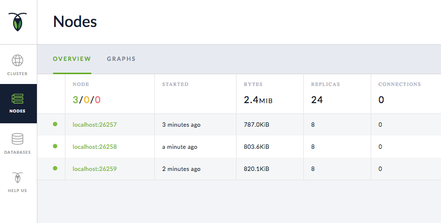
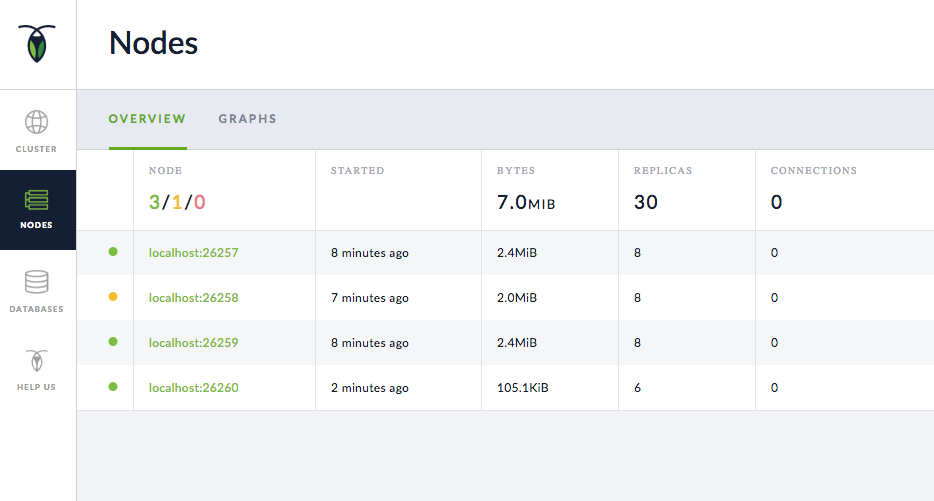

This page walks you through a simple demonstration of how CockroachDB remains available during, and recovers after, failure. Starting with a 3-node local cluster, you'll remove a node and see how the cluster continues uninterrupted. You'll then write some data while the node is offline, rejoin the node, and see how it catches up with the rest of the cluster. Finally, you'll add a fourth node, remove a node again, and see how missing replicas eventually re-replicate to the new node.

## Before You Begin

Make sure you have already [installed CockroachDB](install-cockroachdb.html).

## Step 1. Start a 3-node cluster

{{site.data.alerts.callout_success}}See <a href="start-a-local-cluster.html">Start a Local Cluster</a> for details about <code>cockroach start</code> options.{{site.data.alerts.end}}

~~~ shell
# Start node 1:
$ cockroach start --insecure \
--store=fault-node1 \
--host=localhost \
--background

# Start node 2:
$ cockroach start --insecure \
--store=fault-node2 \
--host=localhost \
--port=26258 \
--http-port=8081 \
--join=localhost:26257 \
--background

# Start node 3:
$ cockroach start --insecure \
--store=fault-node3 \
--host=localhost \
--port=26259 \
--http-port=8082 \
--join=localhost:26257 \
--background
~~~

Open the built-in SQL shell on any node to verify that the cluster is live:

~~~ shell
$ cockroach sql --insecure
# Welcome to the cockroach SQL interface.
# All statements must be terminated by a semicolon.
# To exit: CTRL + D.
~~~

~~~ sql
> SHOW DATABASES;
~~~

~~~
+--------------------+
|      Database      |
+--------------------+
| crdb_internal      |
| information_schema |
| pg_catalog         |
| system             |
+--------------------+
(4 rows)
~~~

Use **CTRL + D**, **CTRL + C**, or `\q` to exit the SQL shell.

## Step 2. Remove a node temporarily

Use the [`cockroach quit`](stop-a-node.html) command to stop node 2 (port `26258`):

~~~ shell
$ cockroach quit --insecure --port=26258
~~~

~~~
initiating graceful shutdown of server
ok
~~~

## Step 3. Verify that the cluster remains available

Open the built-in SQL shell on node 1 (port `26257`) or node 3 (port `26259`):

~~~ shell
$ cockroach sql --insecure --port=26259
# Welcome to the cockroach SQL interface.
# All statements must be terminated by a semicolon.
# To exit: CTRL + D.
~~~

~~~ sql
> SHOW DATABASES;
~~~

~~~
+--------------------+
|      Database      |
+--------------------+
| information_schema |
| pg_catalog         |
| bank               |
| system             |
+--------------------+
(4 rows)
~~~

As you see, despite one node being offline, the cluster continues uninterrupted because a majority of replicas (2/3) remains available. If you were to remove another node, however, leaving only one node live, the cluster would be unresponsive until another node was brought back online.

Use **CTRL + D**, **CTRL + C**, or `\q` to exit the SQL shell.

## Step 4. Write data while the node is offline

Use the [`cockroach gen`](generate-cockroachdb-resources.html) command to generate an example `startrek` database:

<pre class="highlight"><code data-eventcategory="fault1-gen-data">cockroach gen example-data startrek | cockroach sql --insecure
</code></pre>

~~~
CREATE DATABASE
SET
DROP TABLE
DROP TABLE
CREATE TABLE
INSERT 79
CREATE TABLE
INSERT 200
~~~

Once again, open the SQL shell on node 1 (port `26257`) or node 3 (port `26259`) and verify that the new `startrek` database was added with two tables, `episodes` and `quotes`:

~~~ shell
$ cockroach sql --insecure --port=26259
# Welcome to the cockroach SQL interface.
# All statements must be terminated by a semicolon.
# To exit: CTRL + D.
~~~

~~~ sql
> SHOW DATABASES;
~~~

~~~
+--------------------+
|      Database      |
+--------------------+
| crdb_internal      |
| information_schema |
| pg_catalog         |
| startrek           |
| system             |
+--------------------+
(5 rows)
~~~

~~~ sql
> SHOW TABLES FROM startrek;
~~~

~~~
+----------+
|  Table   |
+----------+
| episodes |
| quotes   |
+----------+
(2 rows)
~~~

~~~ sql
> SELECT * FROM startrek.episodes LIMIT 10;
~~~

~~~
+----+--------+-----+--------------------------------+----------+
| id | season | num |             title              | stardate |
+----+--------+-----+--------------------------------+----------+
|  1 |      1 |   1 | The Man Trap                   |   1531.1 |
|  2 |      1 |   2 | Charlie X                      |   1533.6 |
|  3 |      1 |   3 | Where No Man Has Gone Before   |   1312.4 |
|  4 |      1 |   4 | The Naked Time                 |   1704.2 |
|  5 |      1 |   5 | The Enemy Within               |   1672.1 |
|  6 |      1 |   6 | Mudd's Women                   |   1329.8 |
|  7 |      1 |   7 | What Are Little Girls Made Of? |   2712.4 |
|  8 |      1 |   8 | Miri                           |   2713.5 |
|  9 |      1 |   9 | Dagger of the Mind             |   2715.1 |
| 10 |      1 |  10 | The Corbomite Maneuver         |   1512.2 |
+----+--------+-----+--------------------------------+----------+
(10 rows)
~~~

Use **CTRL + D**, **CTRL + C**, or `\q` to exit the SQL shell.

## Step 5. Rejoin the node to the cluster

Rejoin node 2 to the cluster, using the same command that you used in step 1:

~~~ shell
$ cockroach start --insecure \
--store=fault-node2 \
--host=localhost \
--port=26258 \
--http-port=8081 \
--join=localhost:26257 \
--background
~~~

~~~
CockroachDB node starting at {{site.data.strings.start_time}}
build:      CCL {{site.data.strings.version}} @ {{site.data.strings.build_time}}
admin:      http://localhost:8081
sql:        postgresql://root@localhost:26258?sslmode=disable
logs:       node2/logs
store[0]:   path=fault-node2
status:     restarted pre-existing node
clusterID:  {5638ba53-fb77-4424-ada9-8a23fbce0ae9}
nodeID:     2
~~~

## Step 6. Verify that the rejoined node has caught up

Open the SQL shell on the rejoined node 2 (port `26258`) and check for the `startrek` data that was added while the node was offline:

~~~ shell
$ cockroach sql --insecure --port=26258
# Welcome to the cockroach SQL interface.
# All statements must be terminated by a semicolon.
# To exit: CTRL + D.
~~~

~~~ sql
> SELECT * FROM startrek.episodes LIMIT 10;
~~~

~~~
+----+--------+-----+--------------------------------+----------+
| id | season | num |             title              | stardate |
+----+--------+-----+--------------------------------+----------+
|  1 |      1 |   1 | The Man Trap                   |   1531.1 |
|  2 |      1 |   2 | Charlie X                      |   1533.6 |
|  3 |      1 |   3 | Where No Man Has Gone Before   |   1312.4 |
|  4 |      1 |   4 | The Naked Time                 |   1704.2 |
|  5 |      1 |   5 | The Enemy Within               |   1672.1 |
|  6 |      1 |   6 | Mudd's Women                   |   1329.8 |
|  7 |      1 |   7 | What Are Little Girls Made Of? |   2712.4 |
|  8 |      1 |   8 | Miri                           |   2713.5 |
|  9 |      1 |   9 | Dagger of the Mind             |   2715.1 |
| 10 |      1 |  10 | The Corbomite Maneuver         |   1512.2 |
+----+--------+-----+--------------------------------+----------+
(10 rows)
~~~

At first, while node 2 is catching up, it acts as a proxy to one of the other nodes with the data. This shows that even when a copy of the data is not local to the node, it has seamless access.

Soon enough, node 2 catches up entirely. To verify, open the Admin UI at `http://localhost:8080`, click **View nodes list** on the right, and you'll see that all three nodes are listed, and the replica count is identical for each. This means that all data in the cluster has been replicated 3 times; there's a copy of every piece of data on each node.

{{site.data.alerts.callout_success}}CockroachDB replicates data 3 times by default. You can customize the number and location of replicas for the entire cluster or for specific sets of data using <a href="configure-replication-zones.html">replication zones</a>.{{site.data.alerts.end}}

## Step 7. Add another node

Now, to prepare the cluster for a permanent node failure, add a fourth node:

~~~ shell
$ cockroach start --insecure \
--store=fault-node4 \
--host=localhost \
--port=26260 \
--http-port=8083 \
--join=localhost:26257 \
--background
~~~

~~~
CockroachDB node starting at {{site.data.strings.start_time}}
build:      CCL {{site.data.strings.version}} @ {{site.data.strings.build_time}}
admin:      http://localhost:8083
sql:        postgresql://root@localhost:26260?sslmode=disable
logs:       node4/logs
store[0]:   path=fault-node4
status:     initialized new node, joined pre-existing cluster
clusterID:  {5638ba53-fb77-4424-ada9-8a23fbce0ae9}
nodeID:     4
~~~

## Step 8. Remove a node permanently

Again use the [`cockroach quit`](stop-a-node.html) command to stop node 2 (port `26258`):

~~~ shell
$ cockroach quit --insecure --port=26258
~~~

~~~
initiating graceful shutdown of server
ok
server drained and shutdown completed
~~~

## Step 9. Verify that the cluster re-replicates missing replicas

Back in the Admin UI, you'll see 4 nodes listed. After about 1 minute, the dot next to node 2 will turn yellow, indicating that the node is not responding.

After about 10 minutes, node 2 will move into a **Dead Nodes** section, indicating that the node is not expected to come back. At this point, in the **Live Nodes** section, you should also see that the **Replicas** count for node 4 matches the count for node 1 and 3, the other live nodes. This indicates that all missing replicas (those that were on node 2) have been re-replicated to node 4.

## Step 10.  Stop the cluster

Once you're done with your test cluster, use [`cockroach quit`](stop-a-node.html) to stop 2 of the 3 nodes:

~~~ shell
# Stop node 1:
$ cockroach quit --insecure

# Stop node 3:
$ cockroach quit --insecure --port=26259

~~~

With only 1 node still online, a majority of replicas are no longer available (2 of 3), and so the cluster is not operational. As a result, you can't use `cockroach quit` to stop the last node, but instead must get the node's process ID and then force kill it:

~~~ shell
# Get the process ID for node 4:
$ ps | grep cockroach
~~~

~~~
13398 ttys001    0:00.67 cockroach start --insecure --store=fault-node4 --host=localhost --port=26260 --http-port=8083 --join=localhost:26257
~~~

~~~ shell
# Force quit node 4:
$ kill -9 13398
~~~

## What's Next?

Use a local cluster to explore these other core CockroachDB features:

- [Data Replication](demo-data-replication.html)
- [Automatic Rebalancing](demo-automatic-rebalancing.html)
