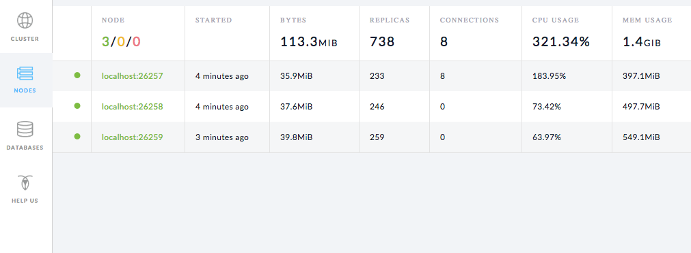
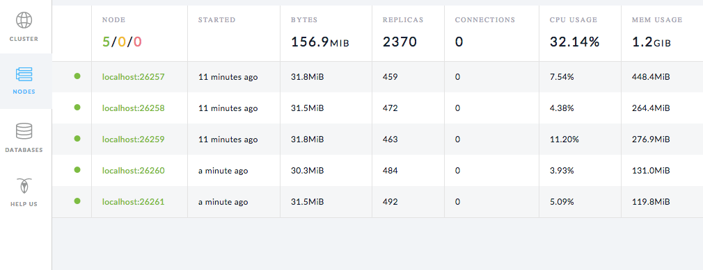

This page walks you through a simple demonstration of how CockroachDB automatically rebalances data as you scale. Starting with a 3-node local cluster, you'll lower the maximum size for a single range, the unit of data that is replicated in CockorachDB. You'll then download and connect the `block_writer` example program, which continuously inserts data into your cluster, and watch the replica count quickly increase as ranges split. You'll then add 2 more nodes and watch how CockroachDB automatically rebalances replicas to efficiently use all available capacity.

## Before You Begin

In this tutorial, you'll use an example Go program to quickly insert data into a CockroachDB cluster. To run the example program, you must have a [Go environment](http://golang.org/doc/code.html) with a 64-bit version of Go 1.7.1.

- You can download the [Go binary](http://golang.org/doc/code.html) directly from the official site. 
- Be sure to set the `$GOPATH` and `$PATH` environment variables as described [here](https://golang.org/doc/code.html#GOPATH).

## Step 1. Start a 3-node cluster

{{site.data.alerts.callout_success}}See <a href="start-a-local-cluster.html">Start a Local Cluster</a> for details about <code>cockroach start</code> options.{{site.data.alerts.end}}

~~~ shell
# Start node 1:
$ cockroach start --background \
--store=scale-node1

# Start node 2:
$ cockroach start --background \
--store=scale-node2 \
--port=26258 \
--http-port=8081 \
--join=localhost:26257

# Start node 3:
$ cockroach start --background \
--store=scale-node3 \
--port=26259 \
--http-port=8082 \
--join=localhost:26257
~~~

Open the [built-in SQL shell](use-the-built-in-sql-client.html) on any node to verify that the cluster is live:

~~~ shell
$ cockroach sql
# Welcome to the cockroach SQL interface.
# All statements must be terminated by a semicolon.
# To exit: CTRL + D.
~~~

~~~ sql
> SHOW DATABASES;
~~~

~~~ 
+--------------------+
|      Database      |
+--------------------+
| information_schema |
| pg_catalog         |
| system             |
+--------------------+
(3 rows)
~~~

## Step 2. Lower the max range size

In CockroachDB, you use [replication zones](configure-replication-zones.html) to control the number and location of replicas. Initially, there is a single default replication zone for the entire cluster that is set to copy each range of data 3 times. This default replication factor is fine for this demo.

However, the default replication zone also defines the size at which a single range of data spits into two ranges. Since you want to create many ranges quickly and then see how CockroachDB automatically rebalances them, reduce the max range size from the default 67108864 bytes (64MB) to cause ranges to split more quickly:

~~~ shell
$ echo -e "range_min_bytes: 1\nrange_max_bytes: 262144" | cockroach zone set .default -f -
~~~

~~~
range_min_bytes: 1
range_max_bytes: 262144
gc:
  ttlseconds: 86400
num_replicas: 3
constraints: []
~~~

## Step 3. Download and run the `block_writer` program

CockroachDB provides a number of [example programs in Go](https://github.com/cockroachdb/examples-go) for simulating client workloads. The program you'll use for this demonstration is called [`block_writer`](https://github.com/cockroachdb/examples-go/tree/master/block_writer). It will simulate multiple clients inserting data into the cluster. 

Download and install the program:

~~~ shell
$ go get github.com/cockroachdb/examples-go/block_writer
~~~

Then run the program for 1 minute, long enough to generate plenty of ranges:

~~~ shell 
$ block_writer -duration 1m
~~~

Once it's running, `block_writer` will output the number of rows written per second:

~~~ shell
    1s:  776.7/sec   776.7/sec
    2s:  696.3/sec   736.7/sec
    3s:  659.9/sec   711.1/sec
    4s:  557.4/sec   672.6/sec
    5s:  485.0/sec   635.1/sec
    6s:  563.5/sec   623.2/sec
    7s:  725.2/sec   637.7/sec
    8s:  779.2/sec   655.4/sec
    9s:  859.0/sec   678.0/sec
   10s:  960.4/sec   706.1/sec
~~~

## Step 4. Watch the replica count increase

Open the Admin UI at `http://localhost:8080`, go to the **Nodes** tab, and you’ll see the bytes, replica count, and other metrics increase as the `block_writer` program inserts data. 

## Step 5. Add 2 more nodes

Adding capacity is as simple as starting more nodes and joining them to the running cluster: 

~~~ shell
# Start node 4:
$ cockroach start --background \
--store=scale-node4 \
--port=26260 \
--http-port=8083 \
--join=localhost:26257

# Start node 5:
$ cockroach start --background \
--store=scale-node5 \
--port=26261 \
--http-port=8084 \
--join=localhost:26257
~~~

## Step 6. Watch data rebalance across all 5 nodes

Back in the Admin UI, on the **Nodes** tab, you'll now see 5 nodes listed. At first, the bytes and replica count will be lower for nodes 4 and 5. Very soon, however, you'll see those metrics even out across all nodes, indicating that data has been automatically rebalanced to utilize the additional capacity of the new nodes.

## Step 7.  Stop the cluster

You can stop the nodes (and therefore the cluster) as follows:

~~~ shell
# Stop node 1:
$ cockroach quit

# Stop node 2: 
$ cockroach quit --port=26258

# Stop node 3:
$ cockroach quit --port=26259

# Stop node 4: 
$ cockroach quit --port=26260

# Stop node 5:
$ cockroach quit --port=26261
~~~

For more details about the `cockroach quit` command, see [Stop a Node](stop-a-node.html).

## What's Next?

Use a local cluster to explore these other core CockroachDB features:

- [Data Replication](demo-data-replication.html)
- [Fault Tolerance & Recovery](demo-fault-tolerance-and-recovery.html)
