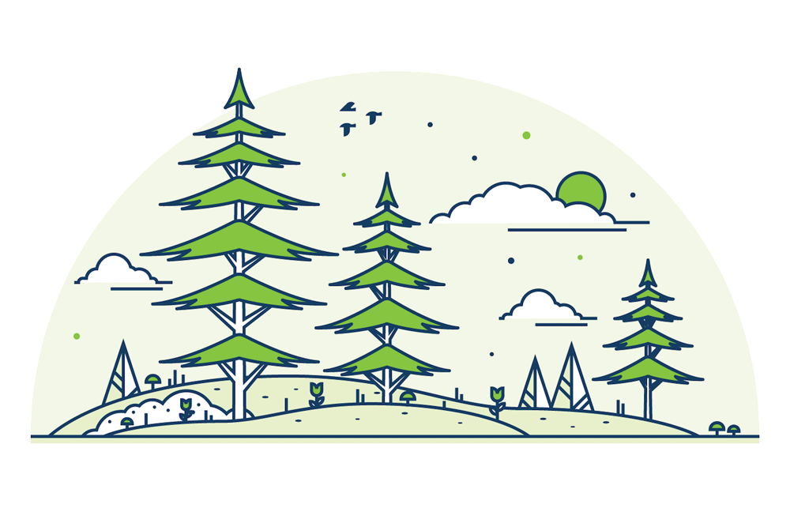

 
CockroachDB is a distributed SQL database built on a transactional and strongly-consistent key-value store. It **scales** horizontally; **survives** disk, machine, rack, and even datacenter failures with minimal latency disruption and no manual intervention; supports **strongly-consistent** ACID transactions; and provides a familiar **SQL** API for structuring, manipulating, and querying data. 

