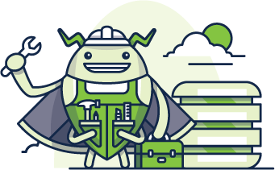
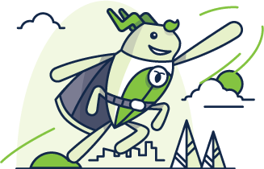

CockroachDB is a distributed SQL database built on a transactional and strongly-consistent key-value store. It scales horizontally; survives disk, machine, rack, and even datacenter failures with minimal latency disruption and no manual intervention; supports strongly-consistent ACID transactions; and provides a familiar SQL API for structuring, manipulating, and querying data. 

The project is currently in **Beta**. For details about upcoming features, see the [Roadmap](https://github.com/cockroachdb/cockroach/wiki).

    <a href="install-cockroachdb.html">
        
        <h3>Install</h3>
    </a>

        <a href="start-a-local-cluster.html">
            
            <h3>Quickstart</h3>
        </a>

    <a href="frequently-asked-questions.html">
        
        <h3>Why CockroachDB?</h3>
    </a>

---

## Recent Articles By CockroachDB Engineers

**[Building an Application with CockroachDB and SQLAlchemy](https://www.cockroachlabs.com/blog/building-application-cockroachdb-sqlalchemy-2/)**

**[Trust, But Verify: How CockroachDB Checks Replication](https://www.cockroachlabs.com/blog/trust-but-verify-cockroachdb-checks-replication/)**

**[A Tale of Two Ports](https://www.cockroachlabs.com/blog/a-tale-of-two-ports/)**

**[Serializable, Lockless, Distributed: Isolation in CockroachDB](https://www.cockroachlabs.com/blog/serializable-lockless-distributed-isolation-cockroachdb/)** 

**[Index Selection in CockroachDB](https://www.cockroachlabs.com/blog/index-selection-cockroachdb-2/)**

