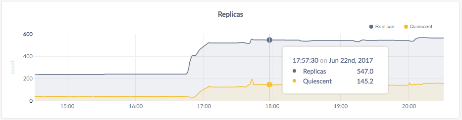

Once you’ve [installed CockroachDB](install-cockroachdb.html), it’s simple to start a multi-node cluster locally with each node listening on a different port.

{{site.data.alerts.callout_info}}Running multiple nodes on a single host is useful for testing out CockroachDB, but it's not recommended for production deployments. To run a physically distributed cluster in production, see <a href="manual-deployment.html">Manual Deployment</a>, <a href="cloud-deployment.html">Cloud Deployment</a>, or <a href="orchestration.html">Orchestration</a>.{{site.data.alerts.end}}

## Before You Begin

Make sure you have already [installed CockroachDB](install-cockroachdb.html).

<!-- TODO: Update the asciicast
Also, feel free to watch this process in action before going through the steps yourself. Note that you can copy commands directly from the video, and you can use **<** and **>** to go back and forward.

<asciinema-player class="asciinema-demo" src="asciicasts/start-a-local-cluster.json" cols="107" speed="2" theme="monokai" poster="npt:0:22" title="Start a Local Cluster"></asciinema-player>
-->

## Step 1. Start the first node

~~~ shell
$ cockroach start --insecure \
--host=localhost \
--background
~~~

~~~
CockroachDB node starting at {{site.data.strings.start_time}}
build:      CCL {{site.data.strings.version}} @ {{site.data.strings.build_time}}
admin:      http://localhost:8080
sql:        postgresql://root@localhost:26257?sslmode=disable
logs:       cockroach-data/logs
store[0]:   path=cockroach-data
status:     initialized new cluster
clusterID:  {dab8130a-d20b-4753-85ba-14d8956a294c}
nodeID:     1
~~~

This command starts a node in insecure mode, accepting most [`cockroach start`](start-a-node.html) defaults.

- The `--insecure` flag makes communication unencrypted.
- Since this is a purely local cluster, `--host=localhost` tells the node to listens only on `localhost`, with default ports used for internal and client traffic (`26257`) and for HTTP requests from the Admin UI (`8080`).
- Node data is stored in the `cockroach-data` directory.
- The `--background` flag runs the node in the background so you can continue the next steps in the same shell.
- The [standard output](start-a-node.html#standard-output) gives you helpful details such as the CockroachDB version, the URL for the admin UI, and the SQL URL for clients.

{{site.data.alerts.callout_success}}By default, each node's cache is limited to 25% of available memory. This default is reasonable when running one node per host. When you run multiple nodes on a single host, however, this default may lead to out-of-memory errors, especially if you test in a serious way. To avoid such errors, you can limit each node's cache size by setting the <code>--cache</code> flag in the <code>start</code> command.{{site.data.alerts.end}}

## Step 2. Add nodes to the cluster

At this point, your cluster is live and operational. With just one node, you can already connect a SQL client and start building out your database. In real deployments, however, you'll always want 3 or more nodes to take advantage of CockroachDB's [automatic replication](demo-data-replication.html), [rebalancing](demo-automatic-rebalancing.html), and [fault tolerance](demo-fault-tolerance-and-recovery.html) capabilities.

To simulate a real deployment, scale your cluster by adding two more nodes:

~~~ shell
# Start the second node:
$ cockroach start --insecure \
--store=node2 \
--host=localhost \
--port=26258 \
--http-port=8081 \
--join=localhost:26257 \
--background

# Start the third node:
$ cockroach start --insecure \
--store=node3 \
--host=localhost \
--port=26259 \
--http-port=8082 \
--join=localhost:26257 \
--background
~~~

The main difference here is that you use the `--join` flag to connect the new nodes to the cluster, specifying the address and port of the first node, in this case `localhost:26257`. Since you're running all nodes on the same machine, you also set the `--store`, `--port`, and `--http-port` flags to locations and ports not used by other nodes, but in a real deployment, with each node on a different machine, the defaults would suffice.

## Step 3. Test the cluster

Now that you've scaled to 3 nodes, you can use any node as a SQL gateway to the cluster. To demonstrate this, start the [built-in SQL client](use-the-built-in-sql-client.html) on node 1:

{{site.data.alerts.callout_info}}The SQL client is built into the <code>cockroach</code> binary, so nothing extra is needed.{{site.data.alerts.end}}

~~~ shell
$ cockroach sql --insecure
# Welcome to the cockroach SQL interface.
# All statements must be terminated by a semicolon.
# To exit: CTRL + D.
~~~

Run some basic [CockroachDB SQL statements](learn-cockroachdb-sql.html):

~~~ sql
> CREATE DATABASE bank;

> CREATE TABLE bank.accounts (id INT PRIMARY KEY, balance DECIMAL);

> INSERT INTO bank.accounts VALUES (1, 1000.50);

> SELECT * FROM bank.accounts;
~~~

~~~
+----+---------+
| id | balance |
+----+---------+
|  1 |  1000.5 |
+----+---------+
(1 row)
~~~

Exit the SQL shell on node 1:

~~~ sql
> \q
~~~

Then start the SQL shell on node 2, this time specifying the node's non-default port:

~~~ shell
$ cockroach sql --insecure --port=26258
# Welcome to the cockroach SQL interface.
# All statements must be terminated by a semicolon.
# To exit: CTRL + D.
~~~

{{site.data.alerts.callout_info}}In a real deployment, all nodes would likely use the default port <code>26257</code>, and so you wouldn't need to set the <code>--port</code> flag.{{site.data.alerts.end}}

Now run the same `SELECT` query:

~~~ sql
> SELECT * FROM bank.accounts;
~~~

~~~
+----+---------+
| id | balance |
+----+---------+
|  1 |  1000.5 |
+----+---------+
(1 row)
~~~

As you can see, node 1 and node 2 behaved identically as SQL gateways.

When you're done, exit the SQL shell on node 2:

~~~ sql
> \q
~~~

## Step 4. Monitor the cluster

To access the [Admin UI](explore-the-admin-ui.html) for your cluster, point a browser to `http://localhost:8080`, or to the address in the `admin` field in the standard output of any node on startup:

As mentioned earlier, CockroachDB automatically replicates your data behind-the-scenes. To verify that data written in the previous step was replicated successfully, scroll down to the **Replicas per Store** graph and hover over the line:

The replica count on each node is identical, indicating that all data in the cluster was replicated 3 times (the default).

{{site.data.alerts.callout_success}}For more insight into how CockroachDB automatically replicates and rebalances data, and tolerates and recovers from failures, see our <a href="demo-data-replication.html">replication</a>, <a href="demo-automatic-rebalancing.html">rebalancing</a>, <a href="demo-fault-tolerance-and-recovery.html">fault tolerance</a> demos.{{site.data.alerts.end}}

## Step 5.  Stop the cluster

Once you're done with your test cluster, stop the first node:

~~~ shell
$ cockroach quit --insecure
~~~

With 2 nodes still online, the cluster remains operational because a majority of replicas are still available. You can verify that the cluster has tolerated this "failure" by starting the built-in SQL shell on nodes 2 or 3:

~~~ shell
$ cockroach sql --insecure --port=26258
# Welcome to the cockroach SQL interface.
# All statements must be terminated by a semicolon.
# To exit: CTRL + D.
~~~

~~~ sql
> SELECT * FROM bank.accounts;
~~~

~~~
+----+---------+
| id | balance |
+----+---------+
|  1 |  1000.5 |
+----+---------+
(1 row)
~~~

Now stop the second node:

~~~
$ cockroach quit --insecure --port=26258
~~~

With only 1 node online, a majority of replicas are no longer available, and so the cluster is not operational. As a result, you can't use `cockroach quit` to stop the last node, but instead must get the node's process ID and then force kill it:

~~~ shell
# Get the process ID for node 3:
$ ps | grep cockroach
~~~

~~~
5084 ttys001    0:50.15 cockroach start --insecure --store=node3 --port=26259 --http-port=8082 --join=localhost:26257
~~~

~~~ shell
# Force quit the process:
$ kill -9 5084
~~~

## What's Next?

[Secure your cluster](secure-a-cluster.html) with authentication and encryption. You might also be interested in:

- [Explore Core Features](demo-data-replication.html)
- [Manual Deployment](manual-deployment.html)
- [Cloud Deployment](cloud-deployment.html)
- [Orchestration](orchestration.html)
- [Import Data](import-data.html)
