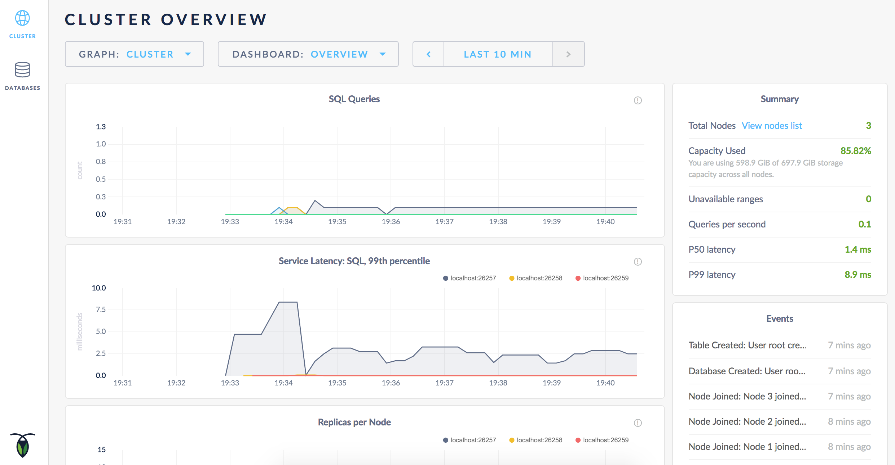

Once you've [installed CockroachDB](install-cockroachdb.html), you can quickly start a single- or multi-node cluster locally with each node listening on a different port. For details about running CockroachDB on multiple machines or in the cloud, see <a href="manual-deployment.html">Manual Deployment</a> or <a href="cloud-deployment.html">Cloud Deployment</a>.

1.  From the directory with the `cockroach` binary, start your first node:

    ~~~ shell
    $ ./cockroach start &

    build:     {{site.data.strings.version}} @ {{site.data.strings.build_time}}
    admin:     http://localhost:8080
    sql:       postgresql://root@localhost:26257?sslmode=disable
    logs:      cockroach-data/logs
    store[0]:  path=cockroach-data
    ~~~

    <button type="button" class="btn details collapsed" data-toggle="collapse" data-target="#details1">Details</button>
    

    - Communication defaults to insecure, with the server listening only on `localhost` on port 26257 for internal and client communication and on port 8080 for HTTP requests from the Admin UI. 
        - To bind to different ports, set `--port=<port>` and `--http-port=<port>`. 
        - To listen on an external address, specify `--insecure` and set `--host=<external address>`. 
    - Node storage defaults to the `cockroach-data` directory. To store to a different location, set `--store=<filepath>`. To use multiple stores, set this flag separately for each.
    - The standard output gives you a helpful summary of the CockroachDB version, the URL for the admin UI, the SQL URL for your client code, and the storage locations for node and debug log data.
    - For more details about the `cockroach start` command, see [Start a Node](start-a-node.html).

    

2.  For each additional node, repeat step 1 with a few extra flags:
   
    ~~~ shell
    $ ./cockroach start --store=cockroach-data2 --port=26258 --http-port=8081 --join=localhost:26257 &
    $ ./cockroach start --store=cockroach-data3 --port=26259 --http-port=8082 --join=localhost:26257 &
    ~~~

    <button type="button" class="btn details collapsed" data-toggle="collapse" data-target="#details2">Details</button>
    

    These commands add two nodes to the cluster, but you can add as many as you like. For each node:
    
    - Set the `--store` flag to a storage location not in use by other nodes. To use multiple stores, set this flag separately for each.
    - Set the `--port` and `--http-port` flags to ports not in use by other nodes.
    - The `--join` flag connects the new node to the cluster. Set this flag to `localhost` and the port of the first node.

    If you don't plan to use more than one node, you can avoid unnecessary log messages about replication by editing the default [replication zone](configure-replication-zones.html) to specify one node instead of three. See [here](troubleshoot.html#replicas-failing-on-a-single-node-cluster) for more details.  

    

3.  Start the [built-in SQL client](use-the-built-in-sql-client.html) as an interactive shell:

    ~~~ shell
    $ ./cockroach sql
    # Welcome to the cockroach SQL interface.
    # All statements must be terminated by a semicolon.
    # To exit: CTRL + D.
    ~~~

4.  Run some [CockroachDB SQL statements](learn-cockroachdb-sql.html):

    ~~~ shell
    root@:26257> CREATE DATABASE bank;
    CREATE DATABASE

    root@:26257> SET DATABASE = bank;
    SET

    root@:26257> CREATE TABLE accounts (id INT PRIMARY KEY, balance DECIMAL);
    CREATE TABLE

    root@26257> INSERT INTO accounts VALUES (1234, DECIMAL '10000.50');
    INSERT 1

    root@26257> SELECT * FROM accounts;
    +------+----------+
    |  id  | balance  |
    +------+----------+
    | 1234 | 10000.50 |
    +------+----------+
    ~~~

    When you're done using the SQL shell, press **CTRL + D** to exit.
 
5.  [Check out the Admin UI](explore-the-admin-ui.html) by pointing your browser to `http://localhost:8080`. You can also find the address in the `admin` field in the standard output of any node on startup.

    

## What's Next?

[Secure your cluster](secure-a-cluster.html) with authentication and encryption.
