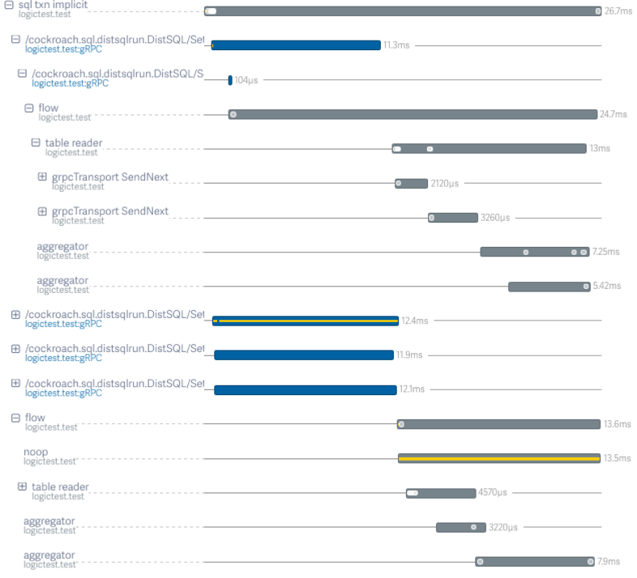

The `SHOW TRACE` [statement](sql-statements.html) allows an operator to observe
how CRDB ran a query or series of queries. It presents information on CRDB
internals; messages from different modules that performed work on behalf of the
query(s) and timing information are presented.

<div id="toc"></div>

Note: The `SHOW TRACE` statement has been introduced in CRDB 1.1.

## Required Privileges

Tracing a statement itself does not require any [privileges](privileges.html),
but the regular privileges are required by the statement apply. 
Listing the session trace does not require any privileges.

## Synopsis



Tracing provides a way to observe the actions took by a CRDB cluster when
executing a statement or a series of statements in the hope on helping users
understand why a query is not performing as expected and for producing better
bug reports. It provides visibility into many layers of the system by presenting
CRDB internal log message from across the stack, together with timing
information. As part of a trace, messages are collected from all the different
nodes that performed work on behalf of the statement under trace (e.g. if the
statement is a query that reads distributed data, all nodes that served parts of
the data will be represented in the trace).

The `SHOW TRACE` statement allows one to either trace a particular statement and
get the trace output or, if "session tracing" has been previously enabled, to
show the trace output of all the recorded statements.

TODO: should we also talk about trace.debug.enable and trace.lightstep.token
cluster settings?


## Parameters

Parameter | Description
----------|------------
`KV` | If specified, the set of trace log messages presented is restricted to messages describing the requests sent by the query execution to the lower-level CRDB Key-Value layer. For `SHOW KV TRACE FOR <stmt>`, some per-result-row messages may be collected, whereas that's generally not the case when `KV` is not specified (in the case of `SHOW KV TRACE FOR SESSION`, per-result-row messages will be displayed if they have been collected; whether they have been collected or not depends on whether `SET tracing = kv` has been used to start trace recording or not. See TODO: link to caveat).

### SHOW TRACE FOR <stmt>

`SHOW TRACE FOR <stmt>` executes `stmt` (the "statement under trace) and returns
the messages produced by CRDB while executing it. The statement is executed
normally, including any side-effects it is normally expected to have on a
database or the cluster (i.e.  inserts/deletes/updates will modify data,
`COMMIT` will commit the transaction, etc.).

Errors encountered by the execution of the statement under trace are not
returned to the client as errors of the `SHOW TRACE` statement; `SHOW TRACE` is
generally not expected to return any errors. An error encountered by the
statement under trace will, however, be reflected in the trace output.
As a consequence, `SHOW TRACE FOR <stmt>` always describes "one attempt" of
executing the statement under trace, even when the client and/or CRDB may
perform retries. Particularly, if the statement under trace represents an
implicit transaction and execution of the statement returns a retriable error
(TODO: link), the statement will not be automatically retried (although it
would have, if it wasn't running under `SHOW TRACE FOR <stmt>`.

### SHOW TRACE FOR SESSION

`SHOW TRACE FOR SESSION` returns the messages produced by all statements that
whose traces were recorded as part of the last session recording. If the
session is currently recording, traces for the statements executed during the
current recording will be returned; in this case the session will continue
recording.

Traces of statements executed on a particular SQL session (i.e. a client
connection) can be recorded by setting the `tracing` session variable (i.e. `SET
tracing = on`). A recording can be stopped with `SET tracing = off`. `SHOW TRACE
FOR SESSION` returns the traces of all the statements recorded. A subsequent
call to `SET tracing = on` clears the previous recording (if any).

TODO: link somewhere / list "tracing" in some list of session variables?

One of the reasons why session recording is useful is for allowing tracing
across retries.  As opposed to `SHOW TRACE FOR <stmt>`, no errors encountered by
statements traced while a recording is on-going are swallowed. So, if CRDB
performs automatic retries for a statement, all the retries will be recorded.
Similarly, if the client is performing client-directed retries (TODO: link), all
statements across all client retries will be recorded.


## Trace description

Before describing the specifics of the `SHOW TRACE` results, this section will
philosophize about what exactly CRDB understands by the "trace" of a query. Our
definition is a specialization of
[OpenTracing's](http://opentracing.io/documentation/#what-is-a-trace) concepts
(CRDB internally uses OpenTracing libraries for tracing, which also means that
it can be easily integrated with OpenTracing-compatible trace collectors -
Lightstep and Zipkin are already supported).

A trace is associated with a high-level operation (a query or a transaction) and
provides information about the sub-operations performed. This information is
internally represented as a tree of "spans", with a special "root span". A
"span" represents a named, timed operation that describes a contiguous segment
of work in that trace. Each span links to "child spans", representing
sub-operations (their children would be sub-sub-operations of the grandparent
span, and so on). Different spans can represent (sub-)operations that executed
either sequentially or in parallel with respect to each other (in fact, the
possibly-parallel nature of execution is one of the important things that a
trace is supposed to describe). The operations described by a trace may be
_distributed_ (different spans may describe operations executed by different
CRDB nodes). A span can contain a list of messages - strings with timing
information. In CRDB, these messages are produced by CRDB's logging
infrastructure, so they are the same messages that one can see in CRDB's log
file (TODO: link), except that, usually, the log file only contains messages
logged at a certain "severity level", whereas the trace contains messages across
all levels (and thus a trace is much more verbose than the log file, but only
contains messages produced in the context of one particular traced operation).
In CRDB, the root spans (and, thus, the high-level operations we're concerned
with) represent either a query execution (in the case of `SHOW TRACE FOR
<stmt>`) or a whole SQL transaction (in the case of recorded sessions).

To give some intuition about the concepts we've just discussed, the following
image shows an example trace for one statement. This particular trace is
"rendered" by Lightstep (this kind of visualization is not currently
available in CRDB alone), and so it is only meant as an illustration. The
rendering, as presented, only shows spans; it does not show any messages (they
could be seen, though, by digging into the boxes). You can see names of
operations and sub-operations, along with parent-child relationships and timing
information, and it's clearly visible what executed in parallel with what else.



## Response

Note: the format of the results may change in future versions.

CRDB does not currently have a graphical trace visualizer (it does, however,
integrate with other products that do). Instead, traces are listed as regular,
linear tabular results. Each result row represents either a span start or a log
messages from a span. Rows are generally listed in their timestamp order (the
order in which the events they represent occurred), except: messages from child
spans are interleaved in the parent span according to their timing. Messages
from sibling spans, however, are not interleaved with respect to one another.
The following diagram shows the order in which messages from different spans will
be interleaved in an example trace. Each box is a span; inner-boxes are child
spans. The numbers indicate the order in which the log messages will appear in
the virtual table.

```
 +-----------------------+
 |           1           |
 | +-------------------+ |
 | |         2         | |
 | |  +----+           | |
 | |  |    | +----+    | |
 | |  | 3  | | 4  |    | |
 | |  |    | |    |  5 | |
 | |  |    | |    | ++ | |
 | |  +----+ |    |    | |
 | |         +----+    | |
 | |          6        | |
 | +-------------------+ |
 |            7          |
 +-----------------------+
```

Rows corresponding to span start events are identified by the `=== SPAN START: <operation> ===` message.

The `SHOW TRACE` statement returns a table with the following columns:

Column | Type                | Description
-------|---------------------|------------
`timestamp` | timestamptz | The absolute time when the message occurred.
`age` | interval | The age of the message relative to the beginning of the trace (i.e. the beginning of the statement execution in case of `SHOW TRACE FOR <stmt` and the beginning of the recording in case of `SHOW TRACE FOR SESSION`.
`message` | string | The log message.
`context` | string | A prefix of the respective log message indicating meta-information about the message's context. This is the same information that appears in the beginning of log file messages in between square brackets (e.g `[client=[::1]:49985,user=root,n1]`).
`operation` | string | The name of the operation (or sub-operation) on whose behalf the message has been logged.
`span` | tuple(int, int) | A tuple containing {index of the transaction that generated the message (always `0` for `SHOW TRACE FOR <stmt>`); index of the span within the virtual list of all spans if they were ordered by the span's start time}


## Caveats and known limitations

1. `SHOW TRACE FOR <stmt>` implies that that the DistSQL execution engine will
   not be used to execute `<stmt>`; the local engine will always be used.
   This may mean that the trace produced does not reflect the way in which the
   query would have run if it wasn't trace. Session recordings do not suffer
   from this limitation: recorded queries can use the DistSQL engine.  
   Tracking issue: [#16562](https://github.com/cockroachdb/cockroach/issues/16562)

2. `SHOW KV TRACE FOR SESSION` may return less results than one might expect,
   depending on how recording was started. If `SET tracing = kv` has been used,
   then there should be no surprises. If, however, another flavor of tracing has
   been used (e.g. `SET tracing = on`), then not all "kv messages" have been
   collected (namely, the "per-result-row" messages have not been collected).
   Therefor, `SHOW KV TRACE FOR SESSION` will not display them.

3. `SHOW TRACE FOR <stmt>` overwrites the last recorded trace. Executing `SHOW TRACE
   FOR SESSION` after having executed `SHOW TRACE FOR <stmt>` will display the
   trace for `<stmt>`.


## Examples


Tracing a simple `SELECT`:

```
root@:26257/t> show trace for select * from foo;
+----------------------------------+------------+-------------------------------------------------------+-----------------------------------+-----------------------------------+-------+
|            timestamp             |    age     |                        message                        |              context              |             operation             | span  |
+----------------------------------+------------+-------------------------------------------------------+-----------------------------------+-----------------------------------+-------+
| 2017-10-03 18:43:06.878722+00:00 | 0s         | === SPAN START: sql txn implicit ===                  | NULL                              | sql txn implicit                  | (0,0) |
| 2017-10-03 18:43:06.879117+00:00 | 395µs810ns | === SPAN START: starting plan ===                     | NULL                              | starting plan                     | (0,1) |
| 2017-10-03 18:43:06.879124+00:00 | 402µs807ns | === SPAN START: consuming rows ===                    | NULL                              | consuming rows                    | (0,2) |
| 2017-10-03 18:43:06.879155+00:00 | 433µs27ns  | querying next range at /Table/51/1                    | [client=[::1]:49985,user=root,n1] | sql txn implicit                  | (0,0) |
| 2017-10-03 18:43:06.879183+00:00 | 461µs194ns | r18: sending batch 1 Scan to (n1,s1):1                | [client=[::1]:49985,user=root,n1] | sql txn implicit                  | (0,0) |
| 2017-10-03 18:43:06.879202+00:00 | 480µs687ns | sending request to local server                       | [client=[::1]:49985,user=root,n1] | sql txn implicit                  | (0,0) |
| 2017-10-03 18:43:06.879216+00:00 | 494µs435ns | === SPAN START: /cockroach.roachpb.Internal/Batch === | NULL                              | /cockroach.roachpb.Internal/Batch | (0,3) |
| 2017-10-03 18:43:06.879219+00:00 | 497µs599ns | 1 Scan                                                | [n1]                              | /cockroach.roachpb.Internal/Batch | (0,3) |
| 2017-10-03 18:43:06.879221+00:00 | 499µs782ns | read has no clock uncertainty                         | [n1]                              | /cockroach.roachpb.Internal/Batch | (0,3) |
| 2017-10-03 18:43:06.879226+00:00 | 504µs105ns | executing 1 requests                                  | [n1,s1]                           | /cockroach.roachpb.Internal/Batch | (0,3) |
| 2017-10-03 18:43:06.879233+00:00 | 511µs539ns | read-only path                                        | [n1,s1,r18/1:/{Table/51-Max}]     | /cockroach.roachpb.Internal/Batch | (0,3) |
| 2017-10-03 18:43:06.87924+00:00  | 518µs150ns | command queue                                         | [n1,s1,r18/1:/{Table/51-Max}]     | /cockroach.roachpb.Internal/Batch | (0,3) |
| 2017-10-03 18:43:06.879247+00:00 | 525µs568ns | waiting for read lock                                 | [n1,s1,r18/1:/{Table/51-Max}]     | /cockroach.roachpb.Internal/Batch | (0,3) |
| 2017-10-03 18:43:06.879287+00:00 | 565µs196ns | read completed                                        | [n1,s1,r18/1:/{Table/51-Max}]     | /cockroach.roachpb.Internal/Batch | (0,3) |
| 2017-10-03 18:43:06.879318+00:00 | 596µs812ns | plan completed execution                              | [client=[::1]:49985,user=root,n1] | consuming rows                    | (0,2) |
| 2017-10-03 18:43:06.87932+00:00  | 598µs552ns | resources released, stopping trace                    | [client=[::1]:49985,user=root,n1] | consuming rows                    | (0,2) |
+----------------------------------+------------+-------------------------------------------------------+-----------------------------------+-----------------------------------+-------+
(16 rows)
```

A trace can be filtered using regular SQL statements by using the `[ <statement> ]`
syntax (TODO: link to secion in table-expressions doc). For example, to see only
messages about spans starting, one could do `SELECT * FROM [SHOW TRACE FOR
<stmt>] where message LIKE '=== SPAN START%'`.

## Notes

The traces presented by `SHOW TRACE` are backed by an internal, per-session,
virtual table: `crdb_internal.session_trace`. `SHOW TRACE` presents a friendlier
view of the data in that table. Currently, `SHOW TRACE` uses the following
query: 
```sql
SELECT timestamp,
       timestamp-first_value(timestamp) OVER (ORDER BY timestamp) AS age,
       message,
       context,
       operation,
       span
  FROM (SELECT timestamp,
               regexp_replace(message, e'^\\[(?:[^][]|\\[[^]]*\\])*\\] ', '') AS message,
               regexp_extract(message, e'^\\[(?:[^][]|\\[[^]]*\\])*\\]') AS context,
               first_value(operation) OVER (PARTITION BY txn_idx, span_idx ORDER BY message_idx) as operation,
               (txn_idx, span_idx) AS span
          FROM crdb_internal.session_trace)
ORDER BY timestamp
```

Of course, in the case of `SHOW TRACE FOR <stmt>`, the `SHOW TRACE` statement
also initiates trace collection (so, it's roughly equivalent to `SET tracing =
cluster; <stmt>; SET tracing = off; SELECT ... FROM
crdb_internal.session_trace;`).


## See Also

- [`EXPLAIN`](explain.html)

